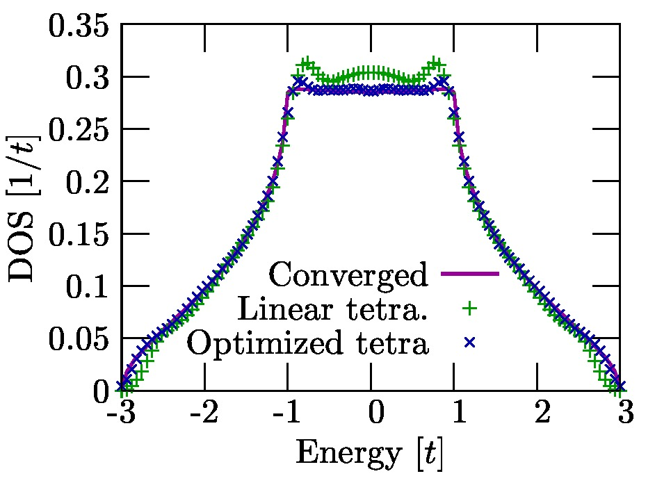
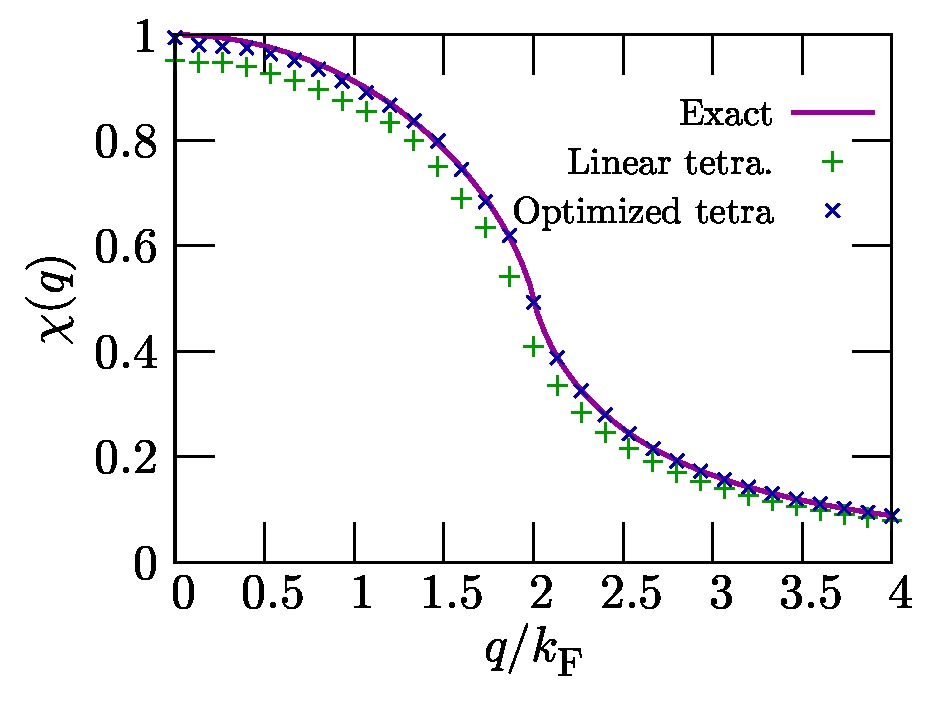

        

--------------

7, Contacts
===========

Please post bag reports and questions to the forum

::

    http://sourceforge.jp/projects/fermisurfer/forums/
        

When you want to join us, please contact me as follows.

The Institute of Solid State Physics

Mitsuaki Kawamura

``mkawamura__at__issp.u-tokyo.ac.jp``

--------------

Appendix 1, Inverse interpolation
=================================

We consider an integration as follows:

$$\\begin{aligned} \\langle X \\rangle = \\sum\_{k} X\_k
w(\\varepsilon\_k). \\end{aligned}$$

If this integration has conditions that

-  $w(\\varepsilon\_k)$ is sensitive to $\\varepsilon\_k$ (e. g. the
   stepfunction, the delta function, etc.) and requires
   $\\varepsilon\_k$ on a dense $k$ grid, and

-  the numerical cost to obtain $X\_k$ is much larger than the cost for
   $\\varepsilon\_k$ (e. g. the polarization function),

it is efficient to interpolate $X\_k$ into a denser $k$ grid and
evaluate that integration in a dense $k$ grid. This method is performed
as follows:

#. Calculate $\\varepsilon\_k$ on a dense $k$grid.

#. Calculate $X\_k$ on a coarse $k$ grid and obtain that on a dense $k$
   grid by using the linear interpolation, the polynomial interpolation,
   the spline interpolation, etc.

   $$\\begin{aligned} X\_k^{\\rm dense} = \\sum\_{k'}^{\\rm coarse}
   F\_{k k'} X\_{k'}^{\\rm coarse} \\end{aligned}$$

#. Evaluate that integration in the dense $k$ grid.

   $$\\begin{aligned} \\langle X \\rangle = \\sum\_{k}^{\\rm dense}
   X\_k^{\\rm dense} w\_k^{\\rm dense} \\end{aligned}$$

**The inverse interpolation method** arrows as to obtain the same result
to above without interpolating $X\_k$ into a dense $k$ grid. In this
method, we map the integration weight on a dense $k$ grid into that on a
coarse $k$ grid (inverse interpolation). Therefore, if we require

$$\\begin{aligned} \\sum\_k^{\\rm dense} X\_k^{\\rm dense} w\_k^{\\rm
dense} = \\sum\_k^{\\rm coarse} X\_k^{\\rm coarse} w\_k^{\\rm coarse},
\\end{aligned}$$

we obtain

$$\\begin{aligned} w\_k^{\\rm coarse} = \\sum\_k^{\\rm dense} F\_{k ' k}
w\_{k'}^{\\rm dense}. \\end{aligned}$$

The numerical procedure for this method is as follows:

#. Calculate the integration weight on a dense $k$ grid $w\_k^{\\rm
   dense}$ from $\\varepsilon\_k$ on a dense $k$ grid.

#. Obtain the integration weight on a coarse $k$ grid $w\_k^{\\rm
   coarse}$ by using the inverse interpolation method.

#. Evaluate that integration in a coarse $k$ grid where $X\_k$ was
   calculated.

All routines in ``libtetrabz`` can perform the inverse interpolation
method; if we make $k$ grids for the orbital energy (``nge``) and the
integration weight (``ngw``) different, we obtain $w\_k^{\\rm coarse}$
calculated by using the inverse interpolation method.

[1] M. Kawamura, Y. Gohda, S. Tsuneyuki, Phys. Rev. B **89** 094515
(2014).

