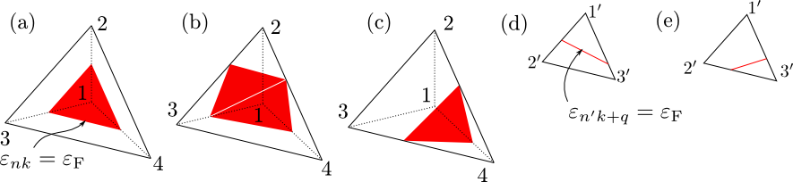

.. _app:

Appendix
========

Inverse interpolation
---------------------

We consider an integration as follows:

.. math::

   \begin{align}
   \langle X \rangle = \sum_{k} X_k w(\varepsilon_k)
   \end{align}

If this integration has conditions that

-  :math:`w(\varepsilon_k)` is sensitive to :math:`\varepsilon_k` (e. g. the
   stepfunction, the delta function, etc.) and requires
   :math:`\varepsilon_k` on a dense :math:`k` grid, and

-  the numerical cost to obtain :math:`X_k` is much larger than the cost for
   :math:`\varepsilon_k` (e. g. the polarization function),

it is efficient to interpolate :math:`X_k` into a denser :math:`k` grid and
evaluate that integration in a dense :math:`k` grid. This method is performed
as follows:

#. Calculate :math:`\varepsilon_k` on a dense :math:`k` grid.

#. Calculate :math:`X_k` on a coarse :math:`k` grid and obtain that on a dense :math:`k`
   grid by using the linear interpolation, the polynomial interpolation,
   the spline interpolation, etc.

.. math::
   
   \begin{align}
   X_k^{\rm dense} = \sum_{k'}^{\rm coarse}
   F_{k k'} X_{k'}^{\rm coarse}
   \end{align}

#. Evaluate that integration in the dense :math:`k` grid.

.. math::
   
   \begin{align}
   \langle X \rangle = \sum_{k}^{\rm dense}
   X_k^{\rm dense} w_k^{\rm dense}
   \end{align}

**The inverse interpolation method**  (Appendix of :ref:`[2] <ref>`)
arrows as to obtain the same result
to above without interpolating :math:`X_k` into a dense :math:`k` grid. In this
method, we map the integration weight on a dense :math:`k` grid into that on a
coarse :math:`k` grid (inverse interpolation). Therefore, if we require

.. math::
   
   \begin{align}
   \sum_k^{\rm dense} X_k^{\rm dense} w_k^{\rm dense}
   = \sum_k^{\rm coarse} X_k^{\rm coarse} w_k^{\rm coarse}
   \end{align}

we obtain

.. math::

   \begin{align}
   w_k^{\rm coarse} = \sum_k^{\rm dense} F_{k' k}
   w_{k'}^{\rm dense}
   \end{align}

The numerical procedure for this method is as follows:

#. Calculate the integration weight on a dense :math:`k` grid
   :math:`w_k^{\rm dense}` from :math:`\varepsilon_k` on a dense :math:`k` grid.

#. Obtain the integration weight on a coarse :math:`k` grid :math:`w_k^{\rm
   coarse}` by using the inverse interpolation method.

#. Evaluate that integration in a coarse :math:`k` grid where :math:`X_k` was
   calculated.

All routines in ``libtetrabz`` can perform the inverse interpolation
method; if we make :math:`k` grids for the orbital energy (``nge``) and the
integration weight (``ngw``) different, we obtain :math:`w_k^{\rm coarse}`
calculated by using the inverse interpolation method.

Double delta integration
------------------------

For the integration

.. math::

   \begin{align}
   \sum_{n n' k} \delta(\varepsilon_{\rm F} -
   \varepsilon_{n k}) \delta(\varepsilon_{\rm F} - \varepsilon'_{n' k})
   X_{n n' k}
   \end{align}

first, we cut out one or two triangles where
:math:`\varepsilon_{n k} = \varepsilon_{\rm F}` from a tetrahedron
and evaluate :math:`\varepsilon_{n' k+q}` at the corners of each triangles as

.. math::

   \begin{align}
   \varepsilon'^{k+q}_{i} = \sum_{j=1}^4 F_{i j}(
   \varepsilon_1^{k}, \cdots, \varepsilon_{4}^{k}, \varepsilon_{\rm F}) 
   \epsilon_{j}^{k+q}.
   \end{align}
   
Then we calculate :math:`\delta(\varepsilon_{n' k+q} - \varepsilon{\rm F})`
in each triangles and obtain weights of corners.
This weights of corners are mapped into those of corners of the original tetrahedron as

.. math::
   
   \begin{align}
   W_{i} = \sum_{j=1}^3 \frac{S}{\nabla_k \varepsilon_k}F_{j i}(
   \varepsilon_{1}^k, \cdots, \varepsilon_{4}^k, \varepsilon_{\rm F}) 
   W'_{j}.
   \end{align}

:math:`F_{i j}` and :math:`\frac{S}{\nabla_k \varepsilon_k}` are calculated as follows 
(:math:`a_{i j} \equiv (\varepsilon_i - \varepsilon_j)/(\varepsilon_{\rm F} - \varepsilon_j)`):

.. _dbldeltapng:

   How to divide a tetrahedron 
   in the case of :math:`\epsilon_1 \leq \varepsilon_{\rm F} \leq \varepsilon_2` (a), 
   :math:`\varepsilon_2 \leq \varepsilon_{\rm F} \leq \varepsilon_3` (b), and
   :math:`\varepsilon_3 \leq \varepsilon_{\rm F} \leq \varepsilon_4` (c).

- When :math:`\varepsilon_1 \leq \varepsilon_{\rm F} \leq \varepsilon_2 \leq \varepsilon_3 \leq\varepsilon_4`
  [Fig. :num:`dbldeltapng` (a)], 

   .. math::
   
      \begin{align}
      F &= 
      \begin{pmatrix}
      a_{1 2} & a_{2 1} &       0 & 0 \\
      a_{1 3} &       0 & a_{3 1} & 0 \\
      a_{1 4} &       0 &       0 & a_{4 1}
      \end{pmatrix}, 
      \qquad
      \frac{S}{\nabla_k \varepsilon_k} = \frac{3 a_{2 1} a_{3 1} a_{4 1}}{\varepsilon_{\rm F} - \varepsilon_1}
      \end{align}
  
- When :math:`\varepsilon_1 \leq \varepsilon_2 \leq \varepsilon_{\rm F} \leq \varepsilon_3 \leq\varepsilon_4`
  [Fig. :num:`dbldeltapng` (b)], 

   .. math::
   
      \begin{align}
      F &= 
      \begin{pmatrix}
      a_{1 3} &       0 & a_{3 1} & 0 \\
      a_{1 4} &       0 &       0 & a_{4 1} \\
      0 & a_{2 4} &       0 & a_{4 2}
      \end{pmatrix}, 
      \qquad
      \frac{S}{\nabla_k \varepsilon_k} = \frac{3 a_{3 1} a_{4 1} a_{2 4}}{\varepsilon_{\rm F} - \varepsilon_1}
      \end{align}
  
   .. math::
   
      \begin{align}
      F &= 
      \begin{pmatrix}
      a_{1 3} &       0 & a_{3 1} & 0 \\
      0 & a_{2 3} & a_{3 2} & 0 \\
      0 & a_{2 4} &       0 & a_{4 2}
      \end{pmatrix}, 
      \qquad
      \frac{S}{\nabla_k \varepsilon_k} = \frac{3 a_{2 3} a_{3 1} a_{4 2}}{\varepsilon_{\rm F} - \varepsilon_1}
      \end{align}

- When :math:`\varepsilon_1 \leq \varepsilon_2 \leq \varepsilon_3 \leq \varepsilon_{\rm F} \leq \varepsilon_4`
  [Fig. :num:`dbldeltapng` (c)], 

   .. math::
   
      \begin{align}
      F &= 
      \begin{pmatrix}
      a_{1 4} &       0 &       0 & a_{4 1} \\
      a_{1 3} & a_{2 4} &       0 & a_{4 2} \\
      a_{1 2} &       0 & a_{3 4} & a_{4 3}
      \end{pmatrix}, 
      \qquad
      \frac{S}{\nabla_k \varepsilon_k} = \frac{3 a_{1 4} a_{2 4} a_{3 4}}{\varepsilon_1 - \varepsilon_{\rm F}}
      \end{align}

Weights on each corners of the triangle are computed as follows
[(:math:`a'_{i j} \equiv (\varepsilon'_i - \varepsilon'_j)/(\varepsilon_{\rm F} - \varepsilon'_j)`)]:

- When :math:`\varepsilon'_1 \leq \varepsilon_{\rm F} \leq \varepsilon'_2 \leq \varepsilon'_3` [Fig. :num:`dbldeltapng` (d)], 

   .. math::
   
      \begin{align}
      W'_1 = L (a'_{1 2} + a'_{1 3}), \qquad
      W'_2 = L a'_{2 1}, \qquad
      W'_3 = L a'_{3 1}, \qquad
      L \equiv \frac{a'_{2 1} a'_{3 1}}{\varepsilon_{\rm F} - \varepsilon'_{1}}
      \end{align}

- When :math:`\varepsilon'_1 \leq \varepsilon'_2 \leq \varepsilon_{\rm F} \leq \varepsilon'_3` [Fig. :num:`dbldeltapng` (e)], 

   .. math::
   
      \begin{align}
      W'_1 = L a'_{1 3}, \qquad
      W'_2 = L a'_{2 3}, \qquad
      W'_3 = L (a'_{3 1} + a'_{3 2}), \qquad
      L \equiv \frac{a'_{1 3} a'_{2 3}}{\varepsilon'_{3} - \varepsilon_{\rm F}} 
      \end{align}
